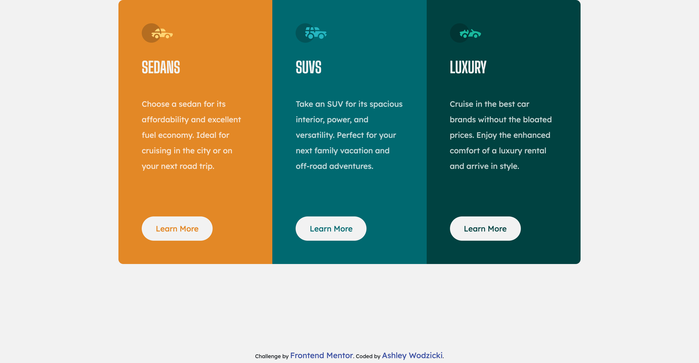

# Frontend Mentor - 3-column preview card component solution

This is a solution to the [3-column preview card component challenge on Frontend Mentor](https://www.frontendmentor.io/challenges/3column-preview-card-component-pH92eAR2-). Frontend Mentor challenges help you improve your coding skills by building realistic projects.

## Table of contents

- [Overview](#overview)
  - [The challenge](#the-challenge)
  - [Screenshot](#screenshot)
- [My process](#my-process)
  - [Built with](#built-with)
- [Author](#author)

## Overview

### The challenge

Users should be able to:

- View the optimal layout depending on their device's screen size
- See hover states for interactive elements

### Screenshot

## My process
I decided to use bootstrap to help with spacing and the grid setup for the different columns. I started the project with the customized styles in css: background colors, font family, buttons, and hover states. I created a container for the 3 columns using bootstrap's container and then utilized grid to create 3 rows. I then added padding and margin to the headings, paragraphs, and buttons to match the design.

### Built with

- CSS custom properties
- CSS Grid
- [Bootstrap](https://getbootstrap.com/)

## Author

- Frontend Mentor - [@alwodzicki](https://www.frontendmentor.io/profile/alwodzicki)
- Twitter - [@ashwodz](https://www.twitter.com/ashwodz)
